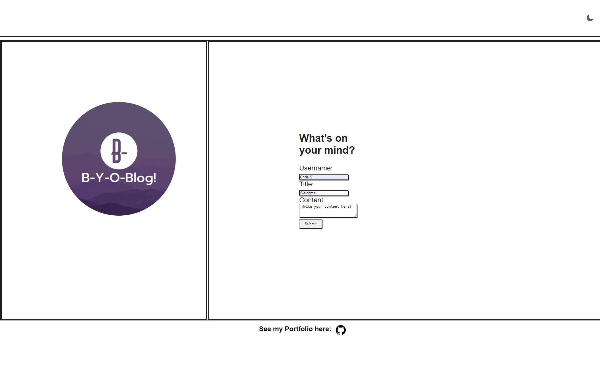

# B-Y-O-Blog

## Description

- My first blog Website! Thsi website uses local storage to keep track of your blogs and orders them accordingly! you can also use a Dark-mode feature I added for lower light environments.

## Usage

- Enter your information and content of your blog before you submit or an alert will let you know that you missed an input.

- when you submit your blog, you can use the back button on the top right corner to be taken to the front page to ad another blog!

- Included on the bottom of the webpage is a link to my portfolio! 

Launched webstie link: https://crissal2.github.io/B-Y-O-Blog/

